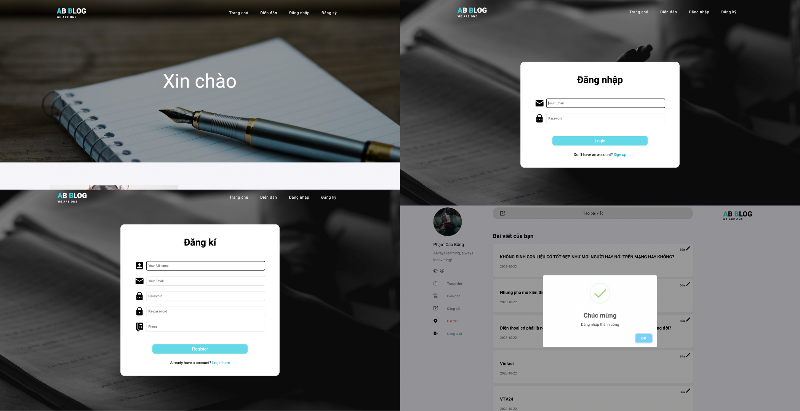
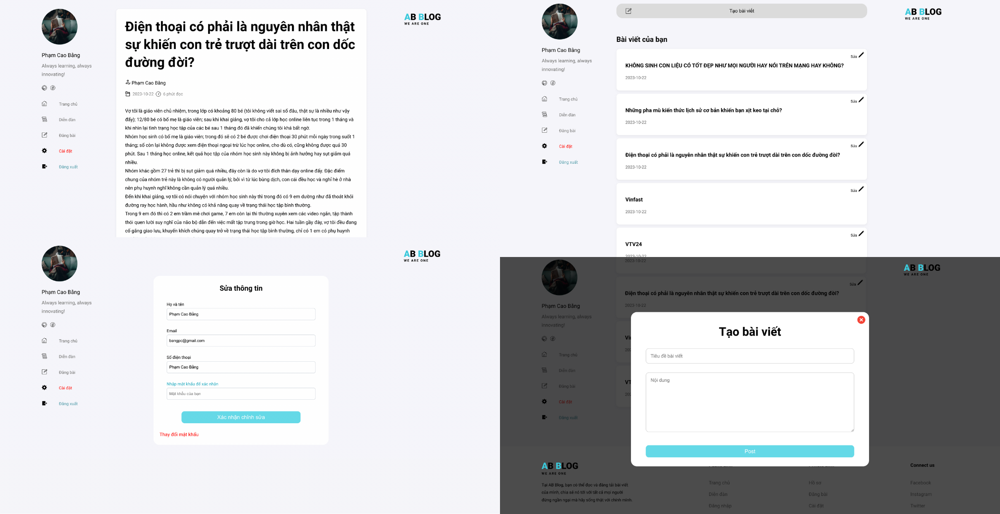

# ABBlog Website

## Giới thiệu

Dự án ABBlog Website là một ứng dụng web đơn giản được thiết kế UI và code bởi các thành viên trong nhóm, cho phép người dùng đăng kí tài khoản, đăng nhập, quản lý thông tin. Tạo và đọc các bài viết của bản thân, cũng như của người khác trên một diễn đàn trực tuyến. Dự án này sử dụng Java Servlet, PostgreSQL để xây dựng phía máy chủ và JSP/CSS/JavaScript cho phía giao diện người dùng.

## Các Tính Năng

- Đăng kí, đăng nhập, chỉnh sửa và xoá tài khoản.
- Quản lí các blog mà người dùng đã tạo.
- Tạo, chỉnh sửa, xoá blog.
- Cho phép người dùng đọc bài Blog của người khác.

## Một số hình ảnh về ứng dụng






## Quản lý database
- Tạo bảng users
  ```sql
  CREATE TABLE users (
	id SERIAL PRIMARY KEY,
	uname varchar(50) NOT NULL,
	uemail varchar(50) NOT NULL,
	upw varchar(50) NOT NULL,
	umobile varchar(20) NOT NULL
  )
- Tạo bảng blog_posts
  ```sql
  CREATE TABLE blog_posts (
      id SERIAL PRIMARY KEY,
      user_id INTEGER,
      title TEXT,
      creation_date TIMESTAMP DEFAULT NOW(),
      content TEXT
  );
- Kết nối ứng dụng với Postgresql
  ```java
  private Connection connection = null;
  private static final String jdbcURL = "jdbc:postgresql://localhost:5432/blog";
  private static final String usernamePostgres = "your_username";
  private static final String passwordPostgres = "your_password";

  public boolean connectDatabase() {
        try {      	
        	connection = DriverManager.getConnection(jdbcURL, usernamePostgres, passwordPostgres);        	
        	if (connection != null) {        		
				System.out.println("Connect successfully");
				return true;				
			}		
	} catch (SQLException e) {		
			e.printStackTrace();			
	}       
        return false;
  };
  ```
## Xây dựng giao diện bằng JSP, JSTL
- Home
  ```jsp
  <head>
        <%@include file="./views/common/meta.jsp" %>   	
        <title>AnhBang Blog</title>     
            
  </head>

  <body>
        <%@include file="./views/common/navbarIndex.jsp" %>    
        <%@include file="./views/components/content/index.jsp" %>
	      <%@include file="./views/common/footer.jsp" %>
  </body>

- Login
  ```jsp
  <head>
        <%@include file="./views/common/meta.jsp" %>   	
        <title>Đăng nhập</title>     
            
  </head>

  <body>
        <input type="hidden" id="status" value="${status }">
        <%@include file="./views/common/navbarIndex.jsp" %>    
        <%@include file="./views/components/content/login.jsp" %>
	      <%@include file="./views/common/footer.jsp" %>
  </body>

- Register (Tương tự Login)
- Forum
  ```jsp
  <head>
        <%@include file="./views/common/meta.jsp" %>   	
        <title>Diễn đàn</title>     
            
  </head>

  <body>
        <div id="forum">
            <%@include file="./views/common/leftSideBar.jsp" %>    
            <%@include file="./views/components/content/forum.jsp" %>
    	      <%@include file="./views/common/rightSideBar.jsp" %>
        </div>
        <%@include file="./views/common/footer.jsp" %>
  </body>
  
- Profile (Tương tự Forum)
- Setting (Tương tự Forum)
- Edit Profile (Tương tự Forum)
- Blog (Tương tự Forum)
- Edit Blog (Tương tự Forum)
- Change Password (Tương tự Forum)
- Delete Blog (Tương tự Forum)
- Confirm Delete (Tương tự Forum)

## Xây dựng Controller
### DAO Pattern (Data Access Object)
- Dao
  ```java
  public interface IDAO<O> {
    	 void insert(O o);
    	 void update(O o);
    	 boolean delete(int id);
    	 O get(int id);
    	 List<O> getAll();	 
  }
  
  public class BlogDAO implements IDAO<Blog> {
    	private DatabaseUtil databaseUtil;
    	private static final String TABLE_NAME = "blog_posts";
    	
    	public BlogDAO() {
    		databaseUtil = new DatabaseUtil();
    		databaseUtil.connectDatabase();
    	}
  }

  public class UserDAO implements IDAO<User> {
    	private DatabaseUtil databaseUtil;
    	private static final String TABLE_NAME_BLOG = "blog_posts";
    	
    	public UserDAO() {
    		databaseUtil = new DatabaseUtil();
    		databaseUtil.connectDatabase();
    	}
  }
  
- Model
  ```java
  public class Blog {
        private int id;
        private int userId;
        private String title;
        private Timestamp creationDate;
        private String content;
        
        public Blog() {
        }
    
        public Blog(int userId, String title, String content) {
            this.userId = userId;
            this.title = title;
            this.content = content;
        }
  }

  public class User {
        private int id;
        private String uname;
        private String uemail;
        private String upw;
        private String umobile;
    
        public User() {}
    
        public User(String uname, String uemail, String upw, String umobile) {
            this.uname = uname;
            this.uemail = uemail;
            this.upw = upw;
            this.umobile = umobile;
        }
  }
  
### User Controller
- Register User
  
  Tiến hành getParameter các "name" có trong form register bằng doPost, đồng thời kiểm tra 2 lần nhập mật khẩu có trùng khớp hay không, cũng như kiểm tra email đã tồn tại hay chưa. Nếu thoả mọi điều kiện thì sẽ gọi phương thức đăng kí user ở lớp UserDAO (Phương thức này sẽ có lệnh SQL để INSERT VALUES)
  
  ```java
  @WebServlet("/register")
  public class RegisterUserController extends HttpServlet {
  
  	private static final long serialVersionUID = 1L;
  	private UserDAO userDAO;
  	
  	public void init() {
  		userDAO = new UserDAO();
  	}
  
  	protected void doPost(HttpServletRequest request, HttpServletResponse response) throws ServletException, IOException {
  		HttpSession session = request.getSession();	
  		
  		String uname = request.getParameter("name");
  		String upw = request.getParameter("pass");
  		String uemail = request.getParameter("email");
  		String reupw = request.getParameter("re_pass");
  		String umobile = request.getParameter("contact");
  		
  		// Check wrong re password
  		if (!upw.equals(reupw)) {
  			session.setAttribute("status", "error wrong repass");
  			System.out.println("status register: " + session.getAttribute("status"));
  			response.sendRedirect("registration.jsp?status=" + session.getAttribute("status"));
  			return;
  		}
  		
  		// Create new user
  		User user = new User(uname, uemail, upw, umobile);
  		
    		try {			
  			UserService userService = new UserService();
  			// Check email already exists
  			if (!userService.userAlreadyExists(uemail)) {
  				userDAO.insert(user);			
  				session.setAttribute("status", "registration success");
  				System.out.println("status register: " + session.getAttribute("status"));
  				response.sendRedirect("login.jsp?status=" + session.getAttribute("status"));
  	            System.out.println("A user has been inserted");
  			} else {
  				session.setAttribute("status", "warning email already");
  				System.out.println("status register: " + session.getAttribute("status"));
  				response.sendRedirect("registration.jsp?status=" + session.getAttribute("status"));
  			}
  			
  		} catch (RuntimeException e) {
  			System.out.println("Error in connecting to Postgresql server");
  			e.printStackTrace();
  		} 
  		
  	}
  
  }
- Delete User
  
  Dựa vào HTTPSession, sẽ nắm bắt được thông tin ID của người dùng đang Login, nếu người dùng xác nhận xoá tài khoản thì sẽ thực thi bằng phương thức deleteUser ở lớp UserDAO. (Code tương tự)
  
- Edit User Information
  
  Dựa vào HTTPSession, sẽ nắm bắt được thông tin ID của người dùng đang Login, đồng thời sẽ kiểm tra mật khẩu chính xác trước khi xác nhận thay đổi thông tin, nếu sai mật khẩu thì sẽ không thể chỉnh sửa thông tin người dùng. (Code tương tự)
  
- Change User Password
  
  Như 3 lớp trên, lớp Change password sẽ tiến hành nhập 3 lần mật khẩu, một lần mật khẩu cũ và 2 lần mật khẩu mới. (Code tương tự)
  
### Blog Controller
- Create Blog
  
  Tiến hành tạo Blog, đồng thời lưu thêm trường user_id là id của người tạo đã tạo Blog đó, khi mọi điều kiện đã hoàn tất, sẽ gọi phương thức createBlog ở lớp BlogDAO.
  
  ```java
  @WebServlet("/createBlogPost")
  public class CreateBlogController extends HttpServlet {
      private static final long serialVersionUID = 1L;
      private BlogDAO blogDAO;
  
      public void init() {
          blogDAO = new BlogDAO();
      }
  
      protected void doPost(HttpServletRequest request, HttpServletResponse response) throws ServletException, IOException {
          HttpSession session = request.getSession();
      	
      	int userId = (int) request.getSession().getAttribute("userId");
          String title = request.getParameter("title-blog");
          String content = request.getParameter("content");
          content = content.replaceAll("\n", "<br>");
          
          // Create a new blog
          Blog blog = new Blog(userId, title, content);
  
          try {
              blogDAO.insert(blog);
              session.setAttribute("status", "success creating a post");
              System.out.println("status createBlog: " + session.getAttribute("status"));
          } catch (RuntimeException e) {
          	session.setAttribute("status", "error when creating a post");
          	System.out.println("status createBlog: " + session.getAttribute("status"));
          }
  
          // Redirect to profile.jsp with status as a query parameter
          response.sendRedirect(request.getContextPath() + "/profile");
      }
  }
- Delete Blog
  
  Mỗi khi click vào xoá blog, sẽ có id của được truyền theo dạng Parameter, sẽ lấy Parameter đó để xoá dựa vào phương thức deleteBlog trong lớp BlogDAO. (Code tương tự)
  
- Edit Blog

  Mỗi khi click vào chỉnh sửa blog, sẽ có id của được truyền theo dạng Parameter, sẽ lấy Parameter đó để xoá dựa vào phương thức updateBlog trong lớp BlogDAO. (Code tương tự)
  
- Read Blog

  Mỗi khi click vào tiêu đề bài viết trên diễn đàn hoặc hồ sơ, thì sẽ link tới trang web /blog chứa tham số là id của blog, sẽ gọi phương thức readBlog để hiển thị blog ra màn hình. (Code tương tự)
  
### Session Login 
- Login

  Mỗi khi login, sẽ kiểm tra xác thực email và password, nếu chính xác thì sẽ Login thành công, đồng thời setAttribute những dữ liệu liên quan tới user đang login, thuận tiện cho việc hiển thị dữ liệu ra UI.
  
  ```java
  @WebServlet(name = "login", value="/login")
  public class Login extends HttpServlet {
  	private static final long serialVersionUID = 1L;
         
  	protected void doPost(HttpServletRequest request, HttpServletResponse response) throws ServletException, IOException {
  
  		String uemail = request.getParameter("email");
  		String upw = request.getParameter("password");
  
  		HttpSession session = request.getSession();
  
          UserService userService = new UserService();
          // Login
  		if (userService.login(uemail, upw)) {
  			
  			int userId = userService.getIdUserLogin();
  			session.setAttribute("userId", userId);
  			
  			String fullname = userService.getUnameLogin();
  			
  			session.setAttribute("fullname", fullname);
  			session.setAttribute("userEmail", userService.getUemailLogin());
  			session.setAttribute("userPhone", userService.getUphoneLogin());
  			session.setAttribute("userPassword", userService.getUpasswordLogin());
  			session.setAttribute("name", fullname.substring(fullname.lastIndexOf(" ") + 1));		
  			session.setAttribute("status", "login success");
  			System.out.println("status login: " + session.getAttribute("status"));
  
  			response.sendRedirect(request.getContextPath() + "/profile");
  			
  		} else {
  			session.setAttribute("status", "error wrong info");
  			System.out.println("status login: " + session.getAttribute("status"));
  			response.sendRedirect(request.getContextPath() + "/login.jsp");
  		} 
  	}  
  }
  
- Logout

  Tiến hành session.invalidate() để thoát mọi session
  
  ```java
  @WebServlet("/logout")
  public class Logout extends HttpServlet {
  	private static final long serialVersionUID = 1L;
  
  	protected void doGet(HttpServletRequest request, HttpServletResponse response) throws ServletException, IOException {
  		
  		HttpSession session = request.getSession();
  		session.setAttribute("status", "success logout");
  		System.out.println("status logout: " + session.getAttribute("status"));
  		response.sendRedirect(request.getContextPath() + "/login.jsp");
  		session.invalidate();
  	}
  
  }

## Cài Đặt

1. Cài đặt [Java](https://www.java.com) và [Tomcat](http://tomcat.apache.org/).
2. Cài đặt [PostgreSQL](https://www.postgresql.org/) và tạo cơ sở dữ liệu với tên "blog".
3. Triển khai ứng dụng trên máy chủ Tomcat - Run on Server

## Sử Dụng

- Truy cập ứng dụng bằng trình duyệt web tại URL: `http://localhost:8080/ten-ung-dung`.

## Tác Giả

- Tên: Phạm Cao Bằng
- Tên: Đức Anh
